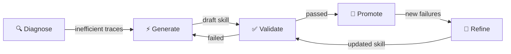

# 🧠 Self-Improving Cortex Agents

**Cut latency + tool misfires by auto-generating and refining operational skills from execution traces.**

Inspired by [Hermes Agent](https://github.com/nousresearch/hermes-agent) — an open-source agent framework with a built-in learning loop that creates and improves its own skills during use — but adapted for Snowflake's governed enterprise environment.


## 🎯 What Is This?

Enterprise AI agents fail repeatedly on the same execution patterns:
- 🔁 Retrying failed tool calls instead of learning the correct approach
- ❌ Passing wrong parameter formats (e.g., total orders vs completed orders)
- ⏱️ Unnecessary tool calls that add latency and cost

These aren't semantic or business context issues — the agent understands *what* to do, it just doesn't know *how* to execute efficiently.

This system **automatically learns operational shortcuts** from production traces and deploys them as reusable skills — no manual prompt engineering required.

## 📊 Demo Results

| Metric | Before | After | Improvement |
|--------|--------|-------|-------------|
| Tool Calls | 5 | 3 | **40% reduction** |
| Latency | 47s | 38s | **19% reduction** |
| Retries | 2 | 0 | **Eliminated** |

## 🏗️ How It Works



### Pipeline Steps:

| Step | Procedure | What It Does |
|------|-----------|--------------|
| 🔍 **Diagnose** | `CREATE_OR_REFINE_SKILLS` | Finds traces exceeding `TOOL_CALL_THRESHOLD` (default: 3) |
| ⚡ **Generate** | `CREATE_OR_REFINE_SKILLS` | Uses LLM to distill failure patterns into a reusable skill |
| ✅ **Validate** | `VALIDATE_SKILLS` | Replays original questions, measures improvement vs baseline |
| 🚀 **Promote** | `PROMOTE_SKILLS` | Deploys validated skill to production via agent versioning |
| 🔄 **Refine** | `CREATE_OR_REFINE_SKILLS` | Updates existing skills when new failure patterns emerge |

### Schedule It on Your Agent:

```sql
-- One setting controls both the task schedule and trace lookback window
-- Configure in: setup/04_create_task.sql
CREATE OR REPLACE TASK EVOLVE_MY_AGENT
    WAREHOUSE = 'COMPUTE_WH'
    SCHEDULE = 'USING CRON 0 2 * * 0 UTC'  -- Weekly (Sunday 2 AM)
AS
    CALL <YOUR_DB>.<YOUR_INFRA_SCHEMA>.EVOLVE_SKILLS(
        '<YOUR_DB>.<YOUR_SCHEMA>.YOUR_AGENT',
        7,                    -- LOOKBACK_DAYS (same as weekly schedule)
        'claude-sonnet-4-5',  -- MODEL_NAME for skill generation
        3                     -- TOOL_CALL_THRESHOLD (tune per your agent)
    );
```

## 🧩 Three Types of Agent Context

| Context | Answers | Examples | Solved By |
|---------|---------|----------|-----------|
| **Semantic** (the *what*) | What does the data mean? | Column definitions, table relationships, which view to query | Semantic Views |
| **Business** (the *what*) | What does the enterprise know? | "Churn = no activity in 90 days", tier thresholds, SLA policies | Cortex Sense / Ontology |
| **Operational** (the *how*) | How should the agent execute? | "Only pass completed orders to credit_check" | **This project** ✅ |

## 🚀 Quick Start

### Prerequisites

- Snowflake account with Cortex Agent access
- ACCOUNTADMIN or equivalent privileges
- Warehouse (X-Small sufficient)
- **An existing Cortex Agent** with tools that you want to optimize

### Step 1: Configure Placeholders

Replace these in all `.py` and `.sql` files:

| Placeholder | Description | Example |
|-------------|-------------|---------|
| `<YOUR_DB>` | Your database | `MY_DATABASE` |
| `<YOUR_AGENT_SCHEMA>` | Schema for agent + domain objects | `SELF_LEARNING_AGENT` |
| `<YOUR_INFRA_SCHEMA>` | Schema for pipeline procs | `AGENT_EVOLUTION` |

```bash
find . -type f \( -name "*.py" -o -name "*.sql" \) -exec sed -i '' \
  -e 's/<YOUR_DB>/MY_DATABASE/g' \
  -e 's/<YOUR_AGENT_SCHEMA>/SELF_LEARNING_AGENT/g' \
  -e 's/<YOUR_INFRA_SCHEMA>/AGENT_EVOLUTION/g' {} +
```

### Step 2: Create Infrastructure

```sql
-- Creates the infra schema, stage, registry table, staging table, and file format
-- Execute: setup/01_setup_infrastructure.sql
```

This creates the supporting objects in your infra schema:
- `AGENT_SKILLS` stage — stores generated skill files
- `SKILL_REGISTRY` table — tracks skill lifecycle (draft → validated → active)
- `SKILL_CONTENT_STAGING` table — helper for COPY INTO operations
- `TEXT_FORMAT` file format — for reading skill files from stage

### Step 3: Deploy Pipeline Procedures

```sql
-- Deploys CREATE_OR_REFINE_SKILLS, VALIDATE_SKILLS, PROMOTE_SKILLS, EVOLVE_SKILLS
-- Copy Python bodies from infrastructure/*.py into the procedure shells
-- Execute: setup/02_deploy_procedures.sql
```

### Step 4: Schedule the Pipeline

Set your frequency once in `setup/04_create_task.sql` — the CRON schedule and the trace lookback window are configured together in one place:

```sql
-- Execute: setup/04_create_task.sql
-- Edit the LOOKBACK_DAYS and CRON to your desired frequency (default: weekly)
```

Or run it manually once to test:

```sql
CALL <YOUR_DB>.<YOUR_INFRA_SCHEMA>.EVOLVE_SKILLS('<YOUR_DB>.<YOUR_AGENT_SCHEMA>.YOUR_AGENT_NAME', 7, 'claude-sonnet-4-5', 3);
```

That's it. The pipeline will analyze your agent's traces, generate skills, validate them, and promote to production.

### (Optional) Run the Demo Example

The `example_agent/` folder contains a sample agent scenario you can deploy to see the system in action:

```sql
-- 1. Create demo tables and seed data
-- Execute: example_agent/tables/tables.sql + seed_data.sql

-- 2. Deploy demo procedures and semantic view
-- Execute: example_agent/procedures/*.py as stored procedures  
-- Execute: example_agent/semantic_views/customer_orders_view.sql

-- 3. Create the demo agent and run the full walkthrough
-- Execute: setup/03_run_demo.sql
```

## 🔬 How It Works (Detailed)

### CREATE_OR_REFINE_SKILLS

1. Queries `GET_AI_OBSERVABILITY_EVENTS()` for traces exceeding `TOOL_CALL_THRESHOLD` within the `LOOKBACK_DAYS` window
2. Extracts tool call details using trace attribute paths:
   - `snow.ai.observability.agent.tool.custom_tool.argument.value`
   - `snow.ai.observability.agent.tool.custom_tool.results`
3. Loads any **existing active skills** (for refinement context)
4. Sends trace context to `SNOWFLAKE.CORTEX.COMPLETE` with structured prompt
5. Generates a `SKILL.md` file with frontmatter (name, description) + 5-8 line instructions
6. Writes to `@AGENT_SKILLS/staging/{skill-name}/SKILL.md`
7. Registers in SKILL_REGISTRY with status=`draft`

**For refinement:** When existing skills cover the same pattern, the LLM prompt includes the current skill content + new failure traces, instructing it to update without regression.

### VALIDATE_SKILLS

The quality gate — ensures a generated skill actually improves execution before touching production:

1. **Read draft skills** from SKILL_REGISTRY
2. **Copy skill to test path** (`@AGENT_SKILLS/skills/test/SKILL.md`) — isolated from production
3. **Create test agent version** using `ALTER AGENT ... ADD LIVE VERSION FROM LAST` + `COMMIT`
4. **Move PRODUCTION alias** to test version
   - ⚠️ Critical: `DATA_AGENT_RUN` routes to PRODUCTION alias, not default version
5. **Replay each original question** via `DATA_AGENT_RUN`
6. **Wait 60 seconds** for observability event flush
   - Agent traces have ~60s latency before appearing in observability table
7. **Measure new trace** against baseline:
   - Gate: `new_tool_calls < original` AND `new_duration < original`
   - Both must improve — if either regresses, validation fails
8. **Restore original PRODUCTION alias** (regardless of pass/fail)
9. **Update registry**: `draft` → `validated` or `failed_validation`

### PROMOTE_SKILLS

The CI/CD step — deploys validated skills as a new production version:

1. **Read validated skills** from registry
2. **Copy skill file** from `staging/{name}/` to permanent `skills/{name}/SKILL.md`
3. **Update agent spec** to include new skill source
4. **Create + commit new agent version**
5. **Set PRODUCTION alias** on new version
6. **Update registry**: `validated` → `active`
7. **Clean up** old validation versions

## 📁 File Structure

```
self_learning_agents/
├── README.md
├── infrastructure/                    # 🔧 The reusable core (works with ANY agent)
│   ├── create_or_refine_skills.py     # Trace analysis + LLM skill generation
│   ├── validate_skills.py            # Replay testing + measurement
│   ├── promote_skills.py             # Version management + deployment
│   └── evolve_skills.sql             # SQL orchestrator
├── example_agent/                     # 📋 Sample agent + data used in the demo (optional)
│   ├── tables/
│   │   ├── tables.sql                # CUSTOMERS + ORDERS DDL
│   │   └── seed_data.sql             # Sample data (15 customers, 33 orders)
│   ├── procedures/
│   │   ├── credit_check_api.py       # Credit scoring (requires completed orders only)
│   │   └── update_crm.py            # Tier update (requires uppercase tier)
│   └── semantic_views/
│       └── customer_orders_view.sql  # Cortex Analyst semantic view
├── setup/                             # 🏁 Deployment scripts (run in order)
│   ├── 01_setup_infrastructure.sql   # Schemas, tables, stage, agent
│   ├── 02_deploy_procedures.sql      # Pipeline stored procedures
│   ├── 03_run_demo.sql              # End-to-end demo walkthrough
│   └── 04_create_task.sql           # Schedule the pipeline as a recurring task
└── docs/
    └── pipeline.gif                  # Architecture diagram
```

> **Note:** The `infrastructure/` folder is the only thing you need to deploy. It works with **any** Cortex Agent — just point `EVOLVE_SKILLS` at your agent's fully-qualified name. The `example_agent/` folder is a sample agent with tables, procedures, and a semantic view that you can deploy to see the system in action end-to-end.

## ⏰ Scheduling Reference

The CRON schedule and `LOOKBACK_DAYS` are set together in `setup/04_create_task.sql`. Reference:

| Frequency | LOOKBACK_DAYS | CRON |
|-----------|---------------|------|
| Daily | 1 | `0 2 * * * UTC` |
| Weekly | 7 | `0 2 * * 0 UTC` |
| Monthly | 30 | `0 2 1 * * UTC` |

## ⚙️ Tuning `TOOL_CALL_THRESHOLD`

The `TOOL_CALL_THRESHOLD` parameter controls **how many tool calls a trace must have before the pipeline flags it as inefficient** and attempts to generate a skill. Default is `3`.

### What it does

The pipeline scans your agent's observability traces and only processes ones where `tool_calls > TOOL_CALL_THRESHOLD`. Traces at or below the threshold are ignored — they're considered normal execution.

### How to set it

1. **Observe your agent's baseline.** Run 5-10 representative questions and check the tool call counts (use the observability query in `03_run_demo.sql` Step 5). Note what a *successful* execution looks like for your agent.
2. **Set threshold above your agent's normal range.** You want to catch retries and failures, not normal variance. LLMs have natural jitter — the same question might take 3 calls one run and 4 the next. A good starting point is **2× your expected call count** or **expected + 2-3**, whichever feels right after observing your baseline.
3. **Iterate.** If the pipeline generates skills for traces that weren't actually failures, raise the threshold. If it's missing obvious retries, lower it.

### The tradeoffs

- **Too low** → false positives. The pipeline generates skills for normal agent behavior, wasting LLM credits and potentially introducing unnecessary instructions.
- **Too high** → missed opportunities. Real retries and failures slip through without being addressed.

```sql
-- Example: agent normally takes 3-4 calls, set threshold to 6 to catch real retries
CALL EVOLVE_SKILLS('DB.SCHEMA.MY_AGENT', 7, 'claude-sonnet-4-5', 6);
```

## ⚠️ Key Technical Notes

| Issue | Detail |
|-------|--------|
| **Observability flush** | Events take ~60s to appear after agent execution |
| **PRODUCTION alias** | `DATA_AGENT_RUN` routes to PRODUCTION alias, not DEFAULT_VERSION |
| **LLM variance** | Same question can take 5-10s for planning depending on model reasoning |
| **Cold start** | Warehouse adds ~6s per proc call on X-Small with auto_suspend=600 |

## ❄️ Snowflake Primitives Used

- **Cortex Agent** — versioning, aliases, skills
- **Agent Observability** — `GET_AI_OBSERVABILITY_EVENTS` for trace analysis
- **SNOWFLAKE.CORTEX.COMPLETE** — LLM-powered skill generation (model is configurable: `claude-sonnet-4-5`, `llama3.1-70b`, `mistral-large2`, etc.)
- **Cortex Skills** — stage-backed `SKILL.md` files
- **Semantic Views** — Cortex Analyst integration
- **Internal Stages** — skill file storage + COPY INTO

## 🚨 Troubleshooting

| Problem | Solution |
|---------|----------|
| `no_retries_found` | Agent hasn't produced traces exceeding your `TOOL_CALL_THRESHOLD`. Run a question that triggers a retry/failure first. |
| `all_traces_already_processed` | All recent inefficient traces already have skills. Try a new question pattern. |
| Validation always fails | Check that PRODUCTION alias is correctly set. Verify observability events are appearing (60s delay). |
| Skill not improving latency | Skill addresses tool calls, not LLM planning time. If deliberation is slow, that's business context (tier mapping, etc). |

## 📝 License

Apache License 2.0

---

**Built with ❄️ Snowflake Cortex AI**
